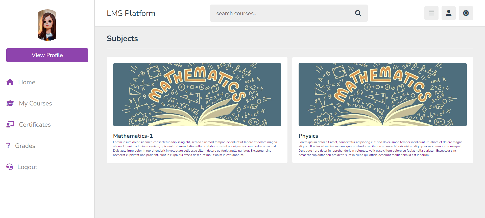

# Learning Management System (LMS) Platform

<div id="carouselExampleIndicators" class="carousel slide" data-bs-ride="carousel">
  <div class="carousel-indicators">
    <button type="button" data-bs-target="#carouselExampleIndicators" data-bs-slide-to="0" class="active" aria-current="true" aria-label="Slide 1"></button>
    <button type="button" data-bs-target="#carouselExampleIndicators" data-bs-slide-to="1" aria-label="Slide 2"></button>
    <!-- Add buttons for each image -->
    <!-- Modify the data-bs-slide-to attribute for each additional image -->
  </div>
  <div class="carousel-inner">
    <div class="carousel-item active">
      
    </div>
    <div class="carousel-item">
      
    </div>
    <!-- Add more carousel-item divs for each additional image -->
  </div>
  <button class="carousel-control-prev" type="button" data-bs-target="#carouselExampleIndicators" data-bs-slide="prev">
    <span class="carousel-control-prev-icon" aria-hidden="true"></span>
    <span class="visually-hidden">Previous</span>
  </button>
  <button class="carousel-control-next" type="button" data-bs-target="#carouselExampleIndicators" data-bs-slide="next">
    <span class="carousel-control-next-icon" aria-hidden="true"></span>
    <span class="visually-hidden">Next</span>
  </button>
</div>


## Project Overview

This Learning Management System (LMS) platform is designed to provide a comprehensive educational solution. Below is an outline of its typical scope:

### Scope
1. **User Management**
    - Authentication and registration
    - User roles and permissions (e.g., instructor, student)
2. **Course Management**
    - The admin manages semesters and semester courses
    - The teacher manages the lessons in a course
    - Creation, editing, and deletion of courses
3. **Content Management**
    - Upload and organization of learning materials (e.g., lectures, videos, documents)
    - Support for multimedia content
4. **Grades Management**
    - Upload, delete, and edit grades for students
    - Students can view their grades
5. **Certificates Management**
   - Upload and delete certificates for students
   - Students can view and download their certificates
6. **Profile Management**
   - Users can add additional information like bio,profile picture which can be updated too

## Installation Guide

### Requirements
- Python
- Django
- HTML, CSS, JavaScript
- dbsqlite

### Steps to Run the Project Locally

1. **Clone the Repository:**
    ```bash
    git clone https://github.com/oneshikaa/LearningManagementPlatform
    ```

2. **Install Dependencies:**
    ```bash
    pip install -r requirements.txt
    ```

3. **Apply Migrations:**
    ```bash
    python manage.py makemigrations
    python manage.py migrate
    ```

4. **Run the Development Server:**
    ```bash
    python manage.py runserver
    ```

5. **Access the Application:**
    Open a web browser and go to `http://localhost:8000/`.

## Project Details

### Product Perspective
The LMS platform is a self-contained product developed from scratch. It serves as a web-based technology designed for planning, implementing, and assessing various learning processes.

### Product Features
The platform encompasses major features such as user, course, content, and grades management.

### User Classes and Characteristics
Users include admin,students,instructors with varying technical expertise and educational levels. The platform aims to be user-friendly for all levels of technical proficiency.


### Operating Environment
The LMS platform operates within a web-based environment, utilizing Django for the backend and supports various browsers and operating systems.

